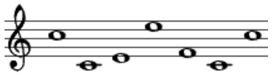

# Pianoman 

In this challenge we got 3 files 

1- python code

https://github.com/rbih-boulanouar/UofTCTF-2024/blob/44f529337bbbad598e3f7d6e7123b5a371cd9835/Cryptography/Pianoman/music_cipher.py#L1-L19

2-this image

3-the output

https://github.com/rbih-boulanouar/UofTCTF-2024/blob/44f529337bbbad598e3f7d6e7123b5a371cd9835/Cryptography/Pianoman/output.txt#L1

in the python code we can see its RSA encryption we have all we need except "e" and we can see the comment say "#a public exponent hidden away by Windy's musical talents"
it seems like we can get "e" from the image.

ok, now lets see the image , its music notes it can be decode using [dcode](https://www.dcode.fr/music-sheet-cipher)

after decoding it we found e and we can decrypt the text using [RsaCtfTool](https://github.com/RsaCtfTool/RsaCtfTool)

sorry for not showing the results i deleted the results file and am too lazy to do the challenges again :p