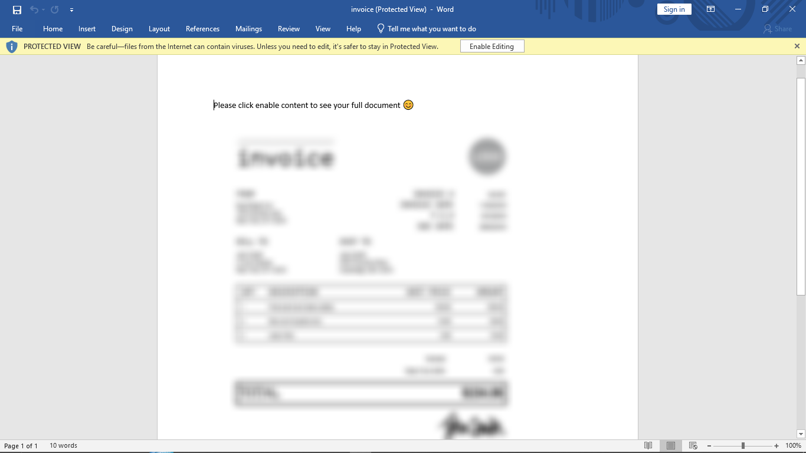
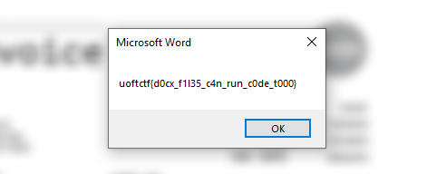
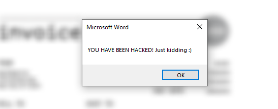

# EnableMe


In this challenge we were given the file [invoice.docm](https://github.com/rbih-boulanouar/UofTCTF-2024/blob/main/Forensics/EnableMe/invoice.docm) which is microsoft word doc.

by the name of the challenge and the description that say "this is not malware" i knew it was about [macros](https://support.microsoft.com/en-us/office/create-or-run-a-macro-c6b99036-905c-49a6-818a-dfb98b7c3c9c) so i open the file with microsoft word and i saw this:



yep you can see that the file trying to execute a macro.

i open macro tab : View > macros > view macros

and i found this:

```vb
Sub AutoOpen()
    Dim v6 As Variant, v7 As Variant
    v6 = Array(98, 120, 113, 99, 116, 99, 113, 108, 115, 39, 116, 111, 72, 113, 38, 123, 36, 34, 72, 116, 35, 121, 72, 101, 98, 121, 72, 116, 39, 115, 114, 72, 99, 39, 39, 39, 106)
    v7 = Array(44, 32, 51, 84, 43, 53, 48, 62, 68, 114, 38, 61, 17, 70, 121, 45, 112, 126, 26, 39, 21, 78, 21, 7, 6, 26, 127, 8, 89, 0, 1, 54, 26, 87, 16, 10, 84)
    
    Dim v8 As Integer: v8 = 23

    Dim v9 As String, v10 As String, v4 As String, i As Integer
    v9 = ""
    For i = 0 To UBound(v6)
        v9 = v9 & Chr(v6(i) Xor Asc(Mid(Chr(v8), (i Mod Len(Chr(v8))) + 1, 1)))
    Next i

    v10 = ""
    For i = 0 To UBound(v7)
        v10 = v10 & Chr(v7(i) Xor Asc(Mid(v9, (i Mod Len(v9)) + 1, 1)))
    Next i

    MsgBox v10
End Sub
```

this is the macro code in VBS.

by looking into the code it seems the if we activate the macro it should show the variable v10.

and in the top you can see 2 arrays v6 and v7 used to create v9 using Xor.

at this point its obvious that v9 is the flag so i thought about taking v6 and v7 and using python script to get v9 (the flag) but luckily we have the permission to edit so i changed `MsgBox v10` to `MsgBox v9` and this happened:



in case you are curious what was v10 variable:


