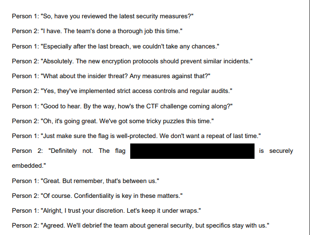

# Secret Message 1


in this challenge we have [pdf file](https://github.com/rbih-boulanouar/UofTCTF-2024/blob/main/Forensics/Secret%20Message%201/secret.pdf)

when i open it it shows the flag hidden it can't be copied.



the idea here is to convert the pdf to text and by using online tool [pdf2go](https://www.pdf2go.com/pdf-to-text) i got this output:

```
Confidential Document
TRANSCRIPT: A Very Private Conversation

Person 1: "So, have you reviewed the latest security measures?"
Person 2: "I have. The team's done a thorough job this time."
Person 1: "Especially after the last breach, we couldn't take any chances."
Person 2: "Absolutely. The new encryption protocols should prevent similar incidents."
Person 1: "What about the insider threat? Any measures against that?"
Person 2: "Yes, they've implemented strict access controls and regular audits."
Person 1: "Good to hear. By the way, how's the CTF challenge coming along?"
Person 2: "Oh, it's going great. We've got some tricky puzzles this time."
Person 1: "Just make sure the flag is well-protected. We don't want a repeat of last time."
Person 2: "Definitely not. The flag 'uoftctf{fired_for_leaking_secrets_in_a_pdf}' is securely
embedded."
Person 1: "Great. But remember, that's between us."
Person 2: "Of course. Confidentiality is key in these matters."
Person 1: "Alright, I trust your discretion. Let's keep it under wraps."
Person 2: "Agreed. We'll debrief the team about general security, but specifics stay with us."
Person 1: "Sounds like a plan. Let's meet next week for another update."
Person 2: "Will do. Take care until then."
```
you can clearly see the flag now : uoftctf{fired_for_leaking_secrets_in_a_pdf}
