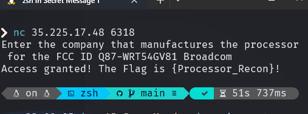

# Baby's first IoT flag 2

In this challenge you need to google the model of the router and after that you can find that Broadcom is the company that make processors for this Device in [wikipedia](https://en.wikipedia.org/wiki/Linksys_WRT54G_series)

after that you need to connect to the given address and port and submit the answer for the flag.

