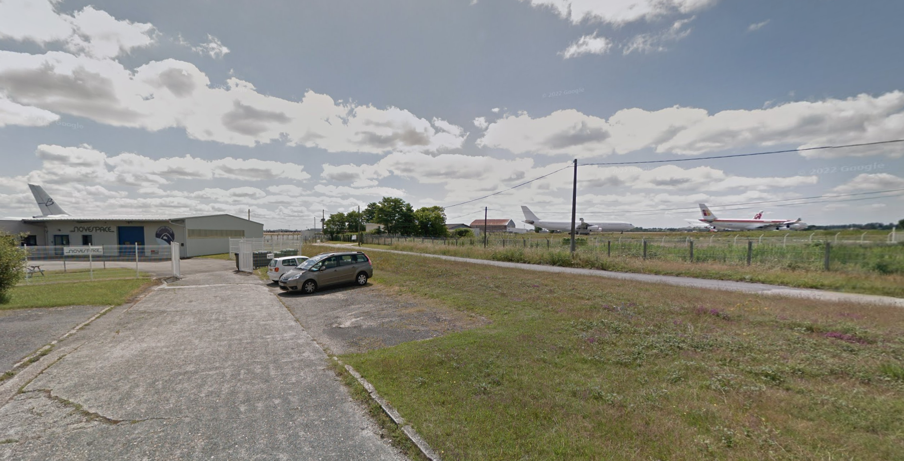

# Flying Hight

in this challenge we got this image:

and we need to find the airport , the airline and the aircraft

in the description they mention that the logo of the airline is red and orange and we can see it in the right.

.png>)

lets google airlines with the same properties 

we got the name of the airline **IBERIA**

next the air port. now in the other side of the photo we can see this 

.png>)

What it Novespace? let's google it. 
it seems to be "subsidiary of the French National Space Center" and it located in Bordeaux France and by using google maps we found that this is **Bordeaux airport**.

next aircraft, we new that the airline is **IBERIA**.
in the [Website of IBERIA](https://www.iberia.com/us/fleet/historic-aircrafts/) we can see all used air crafts and the one that look similar to the photo is **Airbus A300**

the flag is `uoftctf{BOD_IBERIA_A300}`